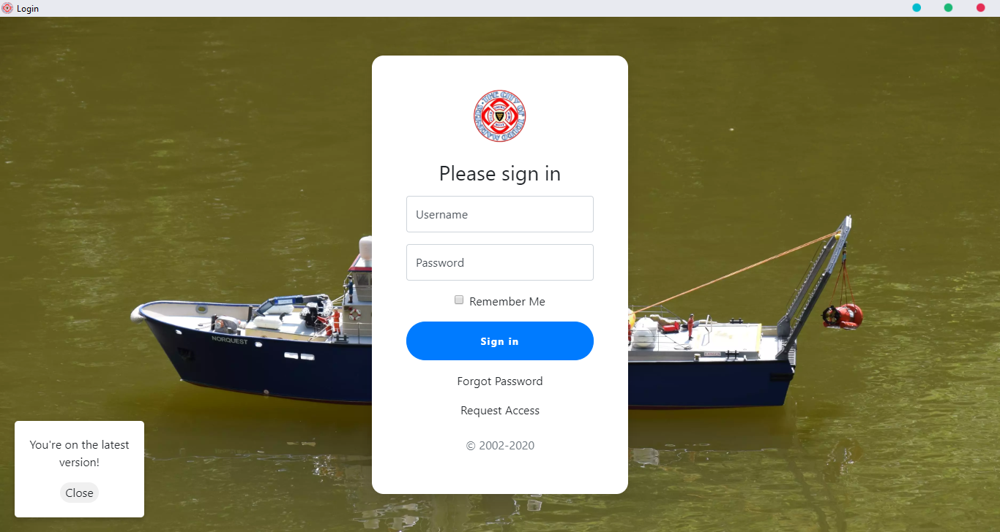

# How to use The City of Truro Mariners - Managment Console

## How to request accesss:

Open the program and click request access then enter an email and hit request your request for access will be sent to our email and it will be confirmed whether or not you are a member.

If you are you will be emailed and an account will be created for you if not and you are simply interested in how this works take a look at the github [here](https://github.com/futurelucas4502/management-console) or [email the developer](mailto:lucaswilson4502@outlook.com).

## Navigating the program:

At first you will be presented with a login screen which will look like this:

If you recieved details about the application in an email simply enter the username and password.

Next you will be taken to the main page and in the top left you will have a hamburger icon '☰' this will open a menu allowing you to see the links to other pages in the program.